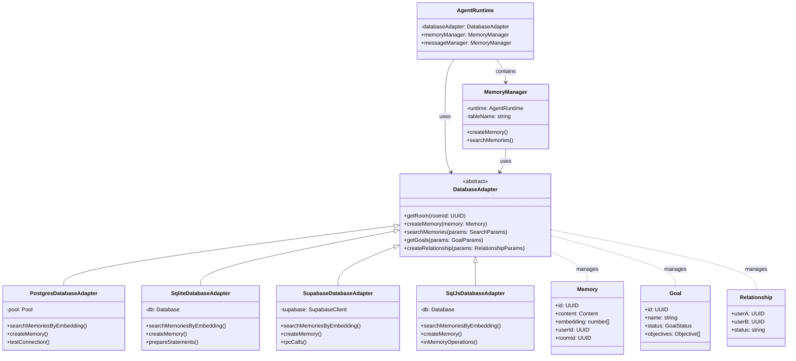

# 🔧 Database Adapters

## Overview

Database Adapters provide Eliza's persistence layer, enabling storage and retrieval of memories, relationships, goals, and other data through a unified interface. The system supports multiple database backends:

### Available Adapters

Each adapter is optimized for different use cases:

- **PostgreSQL** (`@ai16z/adapter-postgres`)

  - Production-ready with vector search
  - Connection pooling and high performance
  - JSONB and pgvector support

- **SQLite** (`@ai16z/adapter-sqlite`)

  - Lightweight local development
  - No external dependencies
  - Full-text search capabilities

- **Supabase** (`@ai16z/adapter-supabase`)

  - Cloud-native PostgreSQL
  - Real-time subscriptions
  - Built-in RPC functions

- **SQL.js** (`@ai16z/adapter-sqljs`)
  - In-memory SQLite for testing
  - Browser compatibility
  - Zero configuration

### Architecture Overview

Eliza's database adapters provide a unified interface for data persistence across different storage backends. The following diagram shows how adapters integrate with the system:



Key components:

- **DatabaseAdapter**: Abstract base class defining the interface
- **Concrete Adapters**: PostgreSQL, SQLite, Supabase, and SQL.js implementations
- **Memory Management**: Integration with MemoryManager for data operations
- **Data Models**: Memory, Goal, and Relationship data structures

---

## Installation

```bash
# PostgreSQL
pnpm add @ai16z/adapter-postgres pg

# SQLite
pnpm add @ai16z/adapter-sqlite better-sqlite3

# SQL.js
pnpm add @ai16z/adapter-sqljs sql.js

# Supabase
pnpm add @ai16z/adapter-supabase @supabase/supabase-js
```

---

## Quick Start

### PostgreSQL Setup

```typescript
import { PostgresDatabaseAdapter } from "@ai16z/adapter-postgres";

const db = new PostgresDatabaseAdapter({
  connectionString: process.env.DATABASE_URL,
  max: 20, // Connection pool size
  idleTimeoutMillis: 30000,
  connectionTimeoutMillis: 2000,
});

// Test connection
await db.testConnection();
```

### SQLite Setup

```typescript
import { SqliteDatabaseAdapter } from "@ai16z/adapter-sqlite";
import Database from "better-sqlite3";

const db = new SqliteDatabaseAdapter(
  new Database("./db.sqlite", {
    // SQLite options
    memory: false,
    readonly: false,
    fileMustExist: false,
  }),
);
```

### Supabase Setup

```typescript
import { SupabaseDatabaseAdapter } from "@ai16z/adapter-supabase";

const db = new SupabaseDatabaseAdapter(
  process.env.SUPABASE_URL!,
  process.env.SUPABASE_ANON_KEY!,
);
```

---

## Core Features

### Memory Operations

```typescript
// Create memory
await db.createMemory({
  id: uuid(),
  type: "messages",
  content: {
    text: "Hello world",
    attachments: [],
  },
  embedding: new Float32Array(1536), // Embedding vector
  userId,
  roomId,
  agentId,
  createdAt: Date.now(),
  unique: true,
});

// Search by embedding
const memories = await db.searchMemories({
  tableName: "messages",
  roomId,
  embedding: vectorData,
  match_threshold: 0.8,
  match_count: 10,
  unique: true,
});

// Get recent memories
const recent = await db.getMemories({
  roomId,
  count: 10,
  unique: true,
  tableName: "messages",
  start: startTime,
  end: endTime,
});
```

### Relationship Management

```typescript
// Create relationship
await db.createRelationship({
  userA: user1Id,
  userB: user2Id,
});

// Get relationship
const relationship = await db.getRelationship({
  userA: user1Id,
  userB: user2Id,
});

// Get all relationships
const relationships = await db.getRelationships({
  userId: user1Id,
});
```

### Goal Management

```typescript
// Create goal
await db.createGoal({
  id: uuid(),
  roomId,
  userId,
  name: "Complete task",
  status: GoalStatus.IN_PROGRESS,
  objectives: [
    { text: "Step 1", completed: false },
    { text: "Step 2", completed: false },
  ],
});

// Update goal status
await db.updateGoalStatus({
  goalId,
  status: GoalStatus.COMPLETED,
});

// Get active goals
const goals = await db.getGoals({
  roomId,
  userId,
  onlyInProgress: true,
  count: 10,
});
```

### Room & Participant Management

```typescript
// Create room
const roomId = await db.createRoom();

// Add participant
await db.addParticipant(userId, roomId);

// Get participants
const participants = await db.getParticipantsForRoom(roomId);

// Get rooms for participant
const rooms = await db.getRoomsForParticipant(userId);
```

---

## Vector Search Implementation

### PostgreSQL (with pgvector)

```typescript
// PostgreSQL vector search
async searchMemoriesByEmbedding(
  embedding: number[],
  params: {
    match_threshold?: number;
    count?: number;
    roomId?: UUID;
    unique?: boolean;
    tableName: string;
  }
): Promise<Memory[]> {
  const client = await this.pool.connect();
  try {
    let sql = `
      SELECT *,
      1 - (embedding <-> $1::vector) as similarity
      FROM memories
      WHERE type = $2
    `;

    const values: any[] = [
      `[${embedding.join(",")}]`,
      params.tableName
    ];

    if (params.unique) {
      sql += ` AND "unique" = true`;
    }

    if (params.roomId) {
      sql += ` AND "roomId" = $3::uuid`;
      values.push(params.roomId);
    }

    if (params.match_threshold) {
      sql += ` AND 1 - (embedding <-> $1::vector) >= $4`;
      values.push(params.match_threshold);
    }

    sql += ` ORDER BY embedding <-> $1::vector`;

    if (params.count) {
      sql += ` LIMIT $5`;
      values.push(params.count);
    }

    const { rows } = await client.query(sql, values);
    return rows.map(row => ({
      ...row,
      content: typeof row.content === "string"
        ? JSON.parse(row.content)
        : row.content,
      similarity: row.similarity
    }));
  } finally {
    client.release();
  }
}
```

### SQLite (with sqlite-vss)

```typescript
// SQLite vector search implementation
async searchMemories(params: {
  tableName: string;
  roomId: UUID;
  embedding: number[];
  match_threshold: number;
  match_count: number;
  unique: boolean;
}): Promise<Memory[]> {
  const queryParams = [
    new Float32Array(params.embedding),
    params.tableName,
    params.roomId,
    params.match_count
  ];

  let sql = `
    SELECT *, vec_distance_L2(embedding, ?) AS similarity
    FROM memories
    WHERE type = ?
  `;

  if (params.unique) {
    sql += " AND `unique` = 1";
  }

  sql += ` ORDER BY similarity ASC LIMIT ?`;

  const memories = this.db.prepare(sql).all(...queryParams);

  return memories.map(memory => ({
    ...memory,
    content: JSON.parse(memory.content),
    similarity: memory.similarity
  }));
}
```

---

## Schema Management

### PostgreSQL Schema

```sql
CREATE EXTENSION IF NOT EXISTS vector;

CREATE TABLE IF NOT EXISTS accounts (
    id UUID PRIMARY KEY,
    "createdAt" DEFAULT CURRENT_TIMESTAMP,
    "name" TEXT,
    "username" TEXT,
    "email" TEXT NOT NULL,
    "avatarUrl" TEXT,
    "details" JSONB DEFAULT '{}'::"jsonb",
    "is_agent" BOOLEAN DEFAULT false NOT NULL,
    "location" TEXT,
    "profile_line" TEXT,
    "signed_tos" BOOLEAN DEFAULT false NOT NULL
);

ALTER TABLE ONLY accounts ADD CONSTRAINT users_email_key UNIQUE (email);

CREATE TABLE IF NOT EXISTS participants (
    "id" UUID PRIMARY KEY,
    "createdAt" TIMESTAMPTZ DEFAULT CURRENT_TIMESTAMP NOT NULL,
    "userId" UUID REFERENCES accounts(id),
    "roomId" UUID REFERENCES rooms(id),
    "userState" TEXT,  -- For MUTED, NULL, or FOLLOWED states
    "last_message_read" UUID
);

ALTER TABLE ONLY participants ADD CONSTRAINT participants_id_key UNIQUE (id);
ALTER TABLE ONLY participants ADD CONSTRAINT participants_roomId_fkey FOREIGN KEY ("roomId") REFERENCES rooms(id);
ALTER TABLE ONLY participants ADD CONSTRAINT participants_userId_fkey FOREIGN KEY ("userId") REFERENCES accounts(id);

CREATE TABLE rooms (
  id UUID PRIMARY KEY,
  "createdAt" TIMESTAMP DEFAULT CURRENT_TIMESTAMP
);

CREATE TABLE memories (
  id UUID PRIMARY KEY,
  type TEXT NOT NULL,
  content JSONB NOT NULL,
  embedding vector(1536),
  "userId" UUID NOT NULL,
  "roomId" UUID NOT NULL,
  "agentId" UUID NOT NULL,
  "unique" BOOLEAN DEFAULT FALSE,
  "createdAt" TIMESTAMP NOT NULL
);

ALTER TABLE ONLY memories ADD CONSTRAINT memories_roomId_fkey FOREIGN KEY ("roomId") REFERENCES rooms(id);
ALTER TABLE ONLY memories ADD CONSTRAINT memories_userId_fkey FOREIGN KEY ("userId") REFERENCES accounts(id);

CREATE INDEX memory_embedding_idx ON
  memories USING ivfflat (embedding vector_cosine_ops)
  WITH (lists = 100);

CREATE TABLE relationships (
  id UUID PRIMARY KEY,
  "userA" UUID NOT NULL,
  "userB" UUID NOT NULL,
  status TEXT DEFAULT 'ACTIVE',
  "createdAt" TIMESTAMP DEFAULT CURRENT_TIMESTAMP
);

ALTER TABLE ONLY relationships ADD CONSTRAINT friendships_id_key UNIQUE (id);
ALTER TABLE ONLY relationships ADD CONSTRAINT relationships_userA_fkey FOREIGN KEY ("userA") REFERENCES accounts(id);
ALTER TABLE ONLY relationships ADD CONSTRAINT relationships_userB_fkey FOREIGN KEY ("userB") REFERENCES accounts(id);
ALTER TABLE ONLY relationships ADD CONSTRAINT relationships_userId_fkey FOREIGN KEY ("userId") REFERENCES accounts(id);

CREATE TABLE goals (
  id UUID PRIMARY KEY,
  "roomId" UUID NOT NULL,
  "userId" UUID,
  name TEXT NOT NULL,
  status TEXT NOT NULL,
  objectives JSONB NOT NULL,
  "createdAt" TIMESTAMP DEFAULT CURRENT_TIMESTAMP
);
```

### SQLite Schema

```typescript
const sqliteTables = `
CREATE TABLE IF NOT EXISTS memories (
  id TEXT PRIMARY KEY,
  type TEXT NOT NULL,
  content TEXT NOT NULL,
  embedding BLOB,
  userId TEXT NOT NULL,
  roomId TEXT NOT NULL,
  agentId TEXT NOT NULL,
  "unique" INTEGER DEFAULT 0,
  createdAt INTEGER NOT NULL
);

CREATE VIRTUAL TABLE IF NOT EXISTS memory_fts 
  USING fts5(content, content_rowid=id);

CREATE TABLE IF NOT EXISTS goals (
  id TEXT PRIMARY KEY,
  roomId TEXT NOT NULL,
  userId TEXT,
  name TEXT NOT NULL,
  status TEXT NOT NULL,
  objectives TEXT NOT NULL,
  createdAt INTEGER DEFAULT (unixepoch())
);
`;
```

---

## Performance Optimization

### Connection Pooling

```typescript
// PostgreSQL connection pool
constructor(connectionConfig: any) {
  super();
  this.pool = new Pool({
    ...connectionConfig,
    max: 20,
    idleTimeoutMillis: 30000,
    connectionTimeoutMillis: 2000
  });

  this.pool.on("error", (err) => {
    console.error("Unexpected error on idle client", err);
  });
}
```

### Prepared Statements

```typescript
// SQLite prepared statements
class SqliteDatabaseAdapter extends DatabaseAdapter {
  private statements = new Map<string, Statement>();

  prepareStatement(sql: string): Statement {
    let stmt = this.statements.get(sql);
    if (!stmt) {
      stmt = this.db.prepare(sql);
      this.statements.set(sql, stmt);
    }
    return stmt;
  }

  // Use prepared statements
  async getMemoryById(id: UUID): Promise<Memory | null> {
    const stmt = this.prepareStatement("SELECT * FROM memories WHERE id = ?");
    const memory = stmt.get(id);
    return memory
      ? {
          ...memory,
          content: JSON.parse(memory.content),
        }
      : null;
  }
}
```

### Batch Operations

```typescript
// Batch memory creation
async createMemories(memories: Memory[], tableName: string) {
  const client = await this.pool.connect();
  try {
    await client.query('BEGIN');

    const stmt = await client.prepare(
      `INSERT INTO memories (
        id, type, content, embedding, "userId",
        "roomId", "agentId", "unique", "createdAt"
      ) VALUES ($1, $2, $3, $4, $5, $6, $7, $8, $9)`
    );

    for (const memory of memories) {
      await stmt.execute([
        memory.id,
        tableName,
        JSON.stringify(memory.content),
        memory.embedding,
        memory.userId,
        memory.roomId,
        memory.agentId,
        memory.unique ?? false,
        memory.createdAt
      ]);
    }

    await client.query('COMMIT');
  } catch (error) {
    await client.query('ROLLBACK');
    throw error;
  } finally {
    client.release();
  }
}
```

---

## Error Handling

```typescript
class DatabaseAdapter {
  protected async withTransaction<T>(
    callback: (client: PoolClient) => Promise<T>,
  ): Promise<T> {
    const client = await this.pool.connect();
    try {
      await client.query("BEGIN");
      const result = await callback(client);
      await client.query("COMMIT");
      return result;
    } catch (error) {
      await client.query("ROLLBACK");
      if (error instanceof DatabaseError) {
        // Handle specific database errors
        if (error.code === "23505") {
          throw new UniqueViolationError(error);
        }
      }
      throw error;
    } finally {
      client.release();
    }
  }
}
```

## Extension Points

### Custom Adapter Implementation

```typescript
class CustomDatabaseAdapter extends DatabaseAdapter {
  constructor(config: CustomConfig) {
    super();
    // Initialize custom database connection
  }

  // Implement required methods
  async createMemory(memory: Memory, tableName: string): Promise<void> {
    // Custom implementation
  }

  async searchMemories(params: SearchParams): Promise<Memory[]> {
    // Custom implementation
  }

  // Add custom functionality
  async customOperation(): Promise<void> {
    // Custom database operation
  }
}
```

---

## Best Practices

1. **Connection Management**

   - Use connection pooling for PostgreSQL
   - Handle connection failures gracefully
   - Implement proper cleanup

2. **Transaction Handling**

   - Use transactions for atomic operations
   - Implement proper rollback handling
   - Manage nested transactions

3. **Error Handling**

   - Implement specific error types
   - Handle constraint violations
   - Provide meaningful error messages

4. **Resource Management**
   - Close connections properly
   - Clean up prepared statements
   - Monitor connection pools

## Related Resources

- [Database Schema Reference](/api)
- [Error Handling](../../packages/core)
