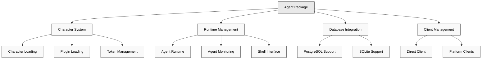

# 🤖 Agent Package

The Agent Package (`@eliza/agent`) provides the high-level orchestration layer for Eliza, managing agent lifecycles, character loading, client initialization, and runtime coordination.

## Architecture Overview



## Key Responsibilities

The Agent Package (`@ai16z/agent`) serves as the orchestration layer for Eliza, handling:

- Character and plugin loading
- Runtime initialization and management
- Database adapter selection
- Client initialization and coordination
- Token and environment management

## Installation

```bash
pnpm add @ai16z/agent
```

## Quick Start

```typescript
import { startAgents, loadCharacters } from "@ai16z/agent";

// Load characters from files
const args = parseArguments();
const characters = await loadCharacters(args.characters || args.character);

// Start agent system
await startAgents();
```

## Core Features

### Character Loading

```typescript
export async function loadCharacters(
  charactersArg: string,
): Promise<Character[]> {
  const characterPaths = normalizeCharacterPaths(charactersArg);
  const loadedCharacters = [];

  for (const path of characterPaths) {
    try {
      const character = JSON.parse(fs.readFileSync(path, "utf8"));

      // Load plugins if specified
      if (character.plugins) {
        character.plugins = await Promise.all(
          character.plugins.map(async (plugin) => {
            const importedPlugin = await import(plugin);
            return importedPlugin;
          }),
        );
      }

      loadedCharacters.push(character);
    } catch (error) {
      console.error(`Error loading character from ${path}: ${error}`);
    }
  }

  // Fall back to default if none loaded
  return loadedCharacters.length > 0 ? loadedCharacters : [defaultCharacter];
}
```

### Agent Creation

```typescript
export async function createAgent(
  character: Character,
  db: IDatabaseAdapter,
  token: string,
) {
  return new AgentRuntime({
    databaseAdapter: db,
    token,
    modelProvider: character.modelProvider,
    character,
    plugins: [
      bootstrapPlugin,
      nodePlugin,
      character.settings.secrets.WALLET_PUBLIC_KEY ? solanaPlugin : null,
    ].filter(Boolean),
    providers: [],
    actions: [],
    services: [],
    managers: [],
  });
}
```

### Client Initialization

```typescript
export async function initializeClients(
  character: Character,
  runtime: IAgentRuntime,
) {
  const clients = [];
  const clientTypes = character.clients?.map((str) => str.toLowerCase()) || [];

  if (clientTypes.includes(Clients.DISCORD)) {
    clients.push(await DiscordClientInterface.start(runtime));
  }
  if (clientTypes.includes(Clients.TELEGRAM)) {
    clients.push(await TelegramClientInterface.start(runtime));
  }
  if (clientTypes.includes(Clients.TWITTER)) {
    clients.push(await TwitterClientInterface.start(runtime));
  }
  if (clientTypes.includes(Clients.DIRECT)) {
    clients.push(await AutoClientInterface.start(runtime));
  }

  return clients;
}
```

## Best Practices

### Token Management

```typescript
export function getTokenForProvider(
  provider: ModelProviderName,
  character: Character,
) {
  switch (provider) {
    case ModelProviderName.OPENAI:
      return (
        character.settings?.secrets?.OPENAI_API_KEY || settings.OPENAI_API_KEY
      );
    case ModelProviderName.ANTHROPIC:
      return (
        character.settings?.secrets?.ANTHROPIC_API_KEY ||
        settings.ANTHROPIC_API_KEY
      );
    // Handle other providers...
  }
}
```

### Database Selection

```typescript
function initializeDatabase() {
  if (process.env.POSTGRES_URL) {
    return new PostgresDatabaseAdapter({
      connectionString: process.env.POSTGRES_URL,
    });
  }
  return new SqliteDatabaseAdapter(new Database("./db.sqlite"));
}
```

## Common Issues & Solutions

1. **Character Loading**

```typescript
// Handle missing character files
if (!characters || characters.length === 0) {
  console.log("No characters found, using default character");
  characters = [defaultCharacter];
}
```

2. **Plugin Loading**

```typescript
// Handle plugin import errors
try {
  character.plugins = await Promise.all(
    character.plugins.map((plugin) => import(plugin)),
  );
} catch (error) {
  console.error(`Error loading plugin: ${error.message}`);
  character.plugins = [];
}
```

## Related Resources

- [Plugin System](../../packages/plugins)
