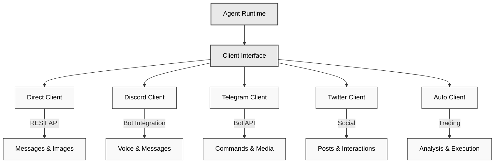

# 🔌 Client Packages

## Overview

Eliza's client packages enable integration with various platforms and services. Each client provides a standardized interface for sending and receiving messages, handling media, and interacting with platform-specific features.

### Architecture Overview



## Available Clients

- **Discord** (`@eliza/client-discord`) - Full Discord bot integration
- **Twitter** (`@eliza/client-twitter`) - Twitter bot and interaction handling
- **Telegram** (`@eliza/client-telegram`) - Telegram bot integration
- **Direct** (`@eliza/client-direct`) - Direct API interface for custom integrations
- **Auto** (`@eliza/client-auto`) - Automated trading and interaction client

---

## Installation

```bash
# Discord
pnpm add @eliza/client-discord

# Twitter
pnpm add @eliza/client-twitter

# Telegram
pnpm add @eliza/client-telegram

# Direct API
pnpm add @eliza/client-direct

# Auto Client
pnpm add @eliza/client-auto
```

---

## Discord Client

The Discord client provides full integration with Discord's features including voice, reactions, and attachments.

### Basic Setup

```typescript
import { DiscordClientInterface } from "@eliza/client-discord";

// Initialize client
const client = await DiscordClientInterface.start(runtime);

// Configuration in .env
DISCORD_APPLICATION_ID = your_app_id;
DISCORD_API_TOKEN = your_bot_token;
```

### Features

- Voice channel integration
- Message attachments
- Reactions handling
- Media transcription
- Room management

### Voice Integration

```typescript
class VoiceManager {
  // Join a voice channel
  async handleJoinChannelCommand(interaction) {
    await this.joinVoiceChannel(channel);
  }

  // Handle voice state updates
  async handleVoiceStateUpdate(oldState, newState) {
    if (newState.channelId) {
      await this.handleUserJoinedChannel(newState);
    }
  }
}
```

### Message Handling

```typescript
class MessageManager {
  async handleMessage(message) {
    // Ignore bot messages
    if (message.author.bot) return;

    // Process attachments
    if (message.attachments.size > 0) {
      await this.processAttachments(message);
    }

    // Generate response
    await this.generateResponse(message);
  }
}
```

## Twitter Client

The Twitter client enables posting, searching, and interacting with Twitter users.

### Basic Setup

```typescript
import { TwitterClientInterface } from "@eliza/client-twitter";

// Initialize client
const client = await TwitterClientInterface.start(runtime);

// Configuration in .env
TWITTER_USERNAME = your_username;
TWITTER_PASSWORD = your_password;
TWITTER_EMAIL = your_email;
TWITTER_COOKIES = your_cookies;
```

### Components

- **PostClient**: Handles creating and managing posts
- **SearchClient**: Handles search functionality
- **InteractionClient**: Manages user interactions

### Post Management

```typescript
class TwitterPostClient {
  async createPost(content: string) {
    return await this.post({
      text: content,
      media: await this.processMedia(),
    });
  }

  async replyTo(tweetId: string, content: string) {
    return await this.post({
      text: content,
      reply: { in_reply_to_tweet_id: tweetId },
    });
  }
}
```

### Search Features

```typescript
class TwitterSearchClient {
  async searchTweets(query: string) {
    return await this.search({
      query,
      filters: {
        recency: "recent",
        language: "en",
      },
    });
  }
}
```

## Telegram Client

The Telegram client provides messaging and bot functionality for Telegram.

### Basic Setup

```typescript
import { TelegramClientInterface } from "@eliza/client-telegram";

// Initialize client
const client = await TelegramClientInterface.start(runtime);

// Configuration in .env
TELEGRAM_BOT_TOKEN = your_bot_token;
```

### Message Management

```typescript
class TelegramClient {
  async handleMessage(message) {
    // Process message content
    const content = await this.processMessage(message);

    // Generate response
    const response = await this.generateResponse(content);

    // Send response
    await this.sendMessage(message.chat.id, response);
  }
}
```

## Direct Client

The Direct client provides a REST API interface for custom integrations.

### Basic Setup

```typescript
import { DirectClientInterface } from "@eliza/client-direct";

// Initialize client
const client = await DirectClientInterface.start(runtime);
```

### API Endpoints

```typescript
class DirectClient {
  constructor() {
    // Message endpoint
    this.app.post("/:agentId/message", async (req, res) => {
      const response = await this.handleMessage(req.body);
      res.json(response);
    });

    // Image generation endpoint
    this.app.post("/:agentId/image", async (req, res) => {
      const images = await this.generateImage(req.body);
      res.json(images);
    });
  }
}
```

## Auto Client

The Auto client enables automated interactions and trading.

### Basic Setup

```typescript
import { AutoClientInterface } from "@eliza/client-auto";

// Initialize client
const client = await AutoClientInterface.start(runtime);
```

### Automated Trading

```typescript
class AutoClient {
  constructor(runtime: IAgentRuntime) {
    this.runtime = runtime;

    // Start trading loop
    this.interval = setInterval(
      () => {
        this.makeTrades();
      },
      60 * 60 * 1000,
    ); // 1 hour interval
  }

  async makeTrades() {
    // Get recommendations
    const recommendations = await this.getHighTrustRecommendations();

    // Analyze tokens
    const analysis = await this.analyzeTokens(recommendations);

    // Execute trades
    await this.executeTrades(analysis);
  }
}
```

## Common Features

### Message Handling

All clients implement standard message handling:

```typescript
interface ClientInterface {
  async handleMessage(message: Message): Promise<void>;
  async generateResponse(context: Context): Promise<Response>;
  async sendMessage(destination: string, content: Content): Promise<void>;
}
```

### Media Processing

```typescript
interface MediaProcessor {
  async processImage(image: Image): Promise<ProcessedImage>;
  async processVideo(video: Video): Promise<ProcessedVideo>;
  async processAudio(audio: Audio): Promise<ProcessedAudio>;
}
```

### Error Handling

```typescript
class BaseClient {
  protected async handleError(error: Error) {
    console.error("Client error:", error);

    if (error.code === "RATE_LIMIT") {
      await this.handleRateLimit(error);
    } else if (error.code === "AUTH_FAILED") {
      await this.refreshAuth();
    }
  }
}
```

---

## Best Practices

1. **Authentication**

   - Store credentials securely in environment variables
   - Implement token refresh mechanisms
   - Handle authentication errors gracefully

2. **Rate Limiting**

   - Implement exponential backoff
   - Track API usage
   - Queue messages during rate limits

3. **Error Handling**

   - Log errors with context
   - Implement retry logic
   - Handle platform-specific errors

4. **Media Processing**
   - Validate media before processing
   - Handle different file formats
   - Implement size limits

### Error Handling

```typescript
class BaseClient {
  protected async handleError(error: Error) {
    if (error.code === "RATE_LIMIT") {
      await this.handleRateLimit(error);
    } else if (error.code === "AUTH_FAILED") {
      await this.refreshAuth();
    } else if (error.code === "NETWORK_ERROR") {
      await this.reconnect();
    }

    // Log error
    console.error("Client error:", {
      type: error.name,
      message: error.message,
      code: error.code,
      stack: error.stack,
    });
  }
}
```

### Resource Management

```typescript
class ClientManager {
  private async cleanup() {
    // Close connections
    await Promise.all(this.connections.map((conn) => conn.close()));

    // Clear caches
    this.cache.clear();

    // Cancel timers
    this.timers.forEach((timer) => clearInterval(timer));
  }

  private async reconnect() {
    await this.cleanup();
    await wait(this.calculateBackoff());
    await this.initialize();
  }
}
```

### Rate Limiting

```typescript
class RateLimiter {
  private async handleRateLimit(error: RateLimitError) {
    const delay = this.calculateBackoff(error);
    await wait(delay);
    return this.retryRequest();
  }

  private calculateBackoff(error: RateLimitError): number {
    return Math.min(this.baseDelay * Math.pow(2, this.attempts), this.maxDelay);
  }
}
```

---

## Performance Optimization

### Connection Management

```typescript
class ClientManager {
  private reconnect() {
    await this.disconnect();
    await wait(this.backoff());
    await this.connect();
  }
}
```

### Message Queuing

```typescript
class MessageQueue {
  async queueMessage(message: Message) {
    await this.queue.push(message);
    this.processQueue();
  }
}
```

## Troubleshooting

### Common Issues

1. **Authentication Failures**

```typescript
// Implement token refresh
async refreshAuth() {
  const newToken = await this.requestNewToken();
  await this.updateToken(newToken);
}
```

2. **Rate Limits**

```typescript
// Handle rate limiting
async handleRateLimit(error) {
  const delay = this.calculateBackoff(error);
  await wait(delay);
  return this.retryRequest();
}
```

3. **Connection Issues**

```typescript
// Implement reconnection logic
async handleDisconnect() {
  await this.reconnect({
    maxAttempts: 5,
    backoff: 'exponential'
  });
}
```

4. **Message Processing Failure**

```typescript
async processMessage(message) {
  try {
    return await this.messageProcessor(message);
  } catch (error) {
    if (error.code === "INVALID_FORMAT") {
      return this.handleInvalidFormat(message);
    }
    throw error;
  }
}
```

## Related Resources

- [Error Handling](../../packages/core)
