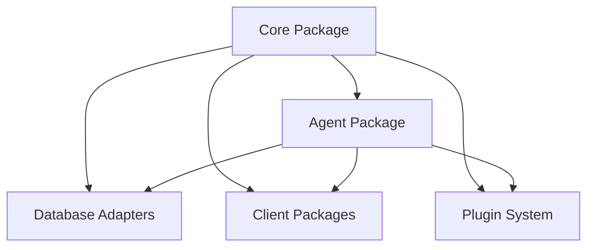

# 📖 Package Overview

## Core Components

- **@ai16z/core**: Central framework and shared functionality
- **@ai16z/agent**: Agent runtime and management
- **@ai16z/adapters**: Database implementations (PostgreSQL, SQLite, etc.)
- **@ai16z/clients**: Platform integrations (Discord, Telegram, etc.)
- **@ai16z/plugins**: Extension modules for additional functionality

## Package Architecture

The Eliza framework is built on a modular architecture where each package serves a specific purpose:

1. **Core Package**: Provides the fundamental building blocks
2. **Agent Package**: Handles agent lifecycle and runtime
3. **Adapters**: Enable different storage backends
4. **Clients**: Connect to various platforms
5. **Plugins**: Add specialized capabilities

## Package Dependencies



## Getting Started

```
# Install core package
pnpm add @ai16z/core

# Install specific adapters
pnpm add @ai16z/adapter-postgres
pnpm add @ai16z/adapter-sqlite

# Install clients
pnpm add @ai16z/client-discord
pnpm add @ai16z/client-Telegram
```
